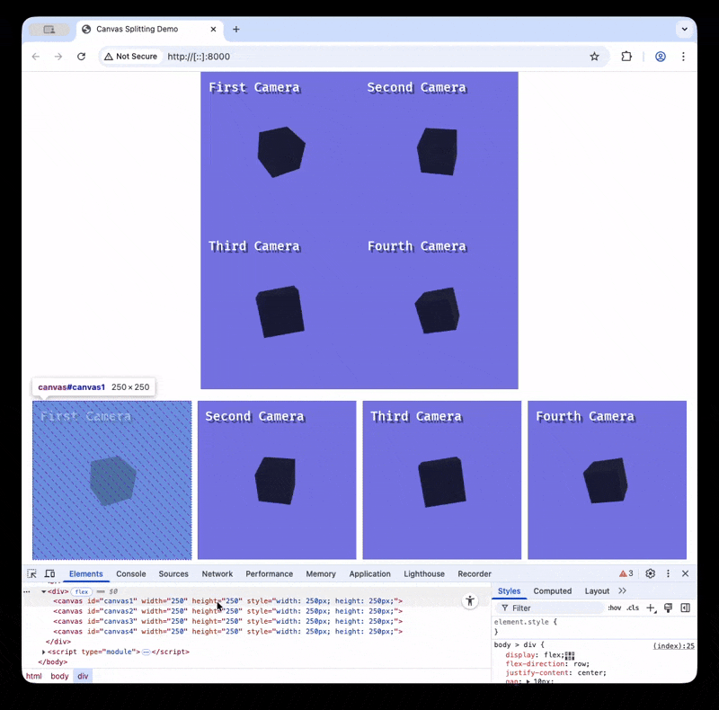

# bevy_split_canvas

An alternative for rendering to [multiple canvases](https://github.com/bevyengine/bevy/issues/20453) while the feature is not available in bevy.

<p align="center">
    
</p>

```bash
# To compile the example
wasm-pack build "examples/" --target web

# To run a simple webserver
cd examples && python3 -m http.server 8000
```

## Compatible Bevy versions

The `main` branch is compatible with the latest Bevy release.

| `bevy_split_canvas` | `bevy` |
| :--           | :--    |
| `0.18`        | `0.18` |
| `0.1`        | `0.17` |